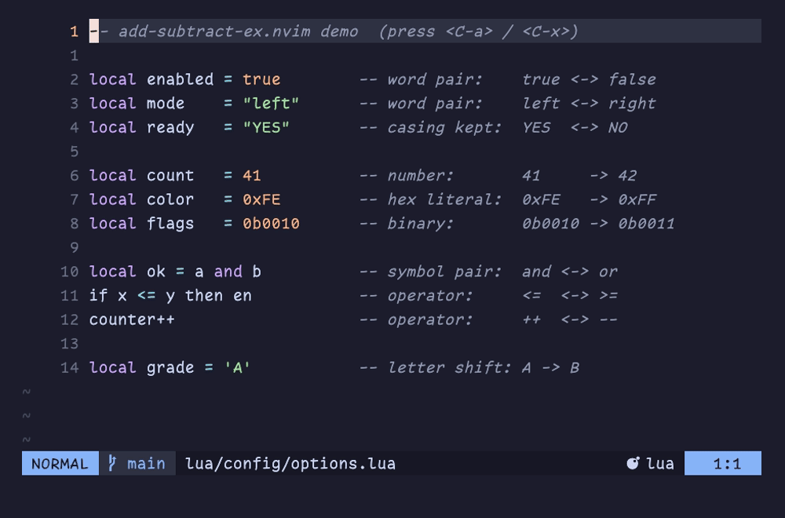

# add-subtract-ex.nvim

[](https://github.com/DRoma82/add-subtract-ex.nvim/actions/workflows/ci.yml)

An extended `CTRL-A` / `CTRL-X` for Neovim.



Native `CTRL-A` (`:help CTRL-A`) adds to the number at or after the cursor.
This plugin keeps that behavior (see the signed-number note below) and extends
the *same* keys to also:

- **Toggle word pairs** — `true`/`false`, `yes`/`no`, `on`/`off`, ... with casing preserved (`TRUE` → `FALSE`, `True` → `False`).
- **Invert symbol pairs** — `&&`/`||`, `==`/`!=`, `<=`/`>=`, `++`/`--`, `+`/`-`.
- **Shift letters** — `a` → `b`, `Z` stays `Z` (no wrapping), with a `count` (`3<C-a>`).
- **Defer to native numbers** — decimal, hex (`0xFF`), and binary (`0b1010`) literals are handled by native `CTRL-A`/`CTRL-X`.

The **earliest target at or after the cursor wins**, mirroring how native
`CTRL-A` targets the nearest number instead of always preferring one kind.

> ⚠️ **Signed numbers:** because `+`/`-` is a built-in symbol pair, by default a
> leading sign is toggled instead of incrementing the number. This applies to
> signed decimal, hex, and binary literals: `-5` → `+5`, `-0xFF` → `+0xFF`,
> `-0b1010` → `+0b1010` (native would give `-4`, `-0x100`, `-0b1011`). Set
> `sign_aware = true` to treat a `+`/`-` immediately before a digit as a number
> sign and defer to native (`-5` → `-4`, `-0xFF` → `-0x100`), while a standalone
> `+`/`-` still toggles.

## Install

### lazy.nvim

```lua
{
  "DRoma82/add-subtract-ex.nvim",
  -- opts = {} triggers setup() with defaults (maps <C-a>/<C-x>)
  opts = {},
}
```

### vim.pack (Neovim 0.12+)

Neovim's built-in manager doesn't run `setup()` for you, so call it after adding
the plugin:

```lua
vim.pack.add({
  { src = "https://github.com/DRoma82/add-subtract-ex.nvim" },
})

require("add-subtract-ex").setup() -- maps <C-a>/<C-x>
```

### packer.nvim

```lua
use({
  "DRoma82/add-subtract-ex.nvim",
  config = function()
    require("add-subtract-ex").setup()
  end,
})
```

## Configuration

Defaults:

```lua
require("add-subtract-ex").setup({
  -- Keys to map in normal mode.
  --   nil (omit)  -> map <C-a> / <C-x>
  --   false       -> map nothing, leave <C-a>/<C-x> native
  --   table       -> map exactly these; omitted directions stay native
  keys = { increment = "<C-a>", decrement = "<C-x>" },

  -- Enable alphabetical letter shifting (a -> b).
  letters = true,

  -- Treat a +/- directly before a digit as a number sign: defer to native
  -- so signed numbers increment (-5 -> -4) instead of flipping (-5 -> +5).
  sign_aware = false,

  -- Include the shipped word/symbol dictionaries.
  builtins = true,

  -- Extra pairs. Each { a, b } toggles both ways. A pair whose first element
  -- matches a built-in (e.g. { "true", "apple" }) overrides that built-in.
  words = {},
  symbols = {},
})
```

### Custom keys (leaving `<C-a>`/`<C-x>` native)

```lua
require("add-subtract-ex").setup({
  keys = { increment = "<leader>a", decrement = "<leader>x" },
})
```

### Extending and overriding dictionaries

```lua
require("add-subtract-ex").setup({
  words = {
    { "foo", "bar" },      -- new pair
    { "true", "apple" },   -- overrides the built-in true/false
  },
  symbols = {
    { "<", ">" },
  },
})
```

### Disabling built-ins

```lua
require("add-subtract-ex").setup({
  builtins = false,
  words = { { "true", "false" } },
})
```

## API

Without keymaps you can call the functions directly:

```lua
local ase = require("add-subtract-ex")
ase.increment() -- like <C-a>
ase.decrement() -- like <C-x>
```

A count applies to numbers and letter shifts (e.g. `5<C-a>` adds 5, or shifts a
letter 5 positions). Word and symbol pairs are single toggles and ignore the count.

## Tests

A dependency-free headless Neovim suite lives in `tests/run.lua`:

```sh
make test
# or
nvim --headless --clean -u NONE -l tests/run.lua
```

It exits non-zero on failure, so it drops straight into CI.

## Acknowledgements

This started life as a standalone Lua script in my personal Neovim config.
[nvim-toggler](https://github.com/nguyenvukhang/nvim-toggler) by
[@nguyenvukhang](https://github.com/nguyenvukhang) is what inspired me to turn
that config into a proper plugin — thanks for the nudge! Go check it out if you
want a focused, configurable word-inversion plugin.

## License

MIT
