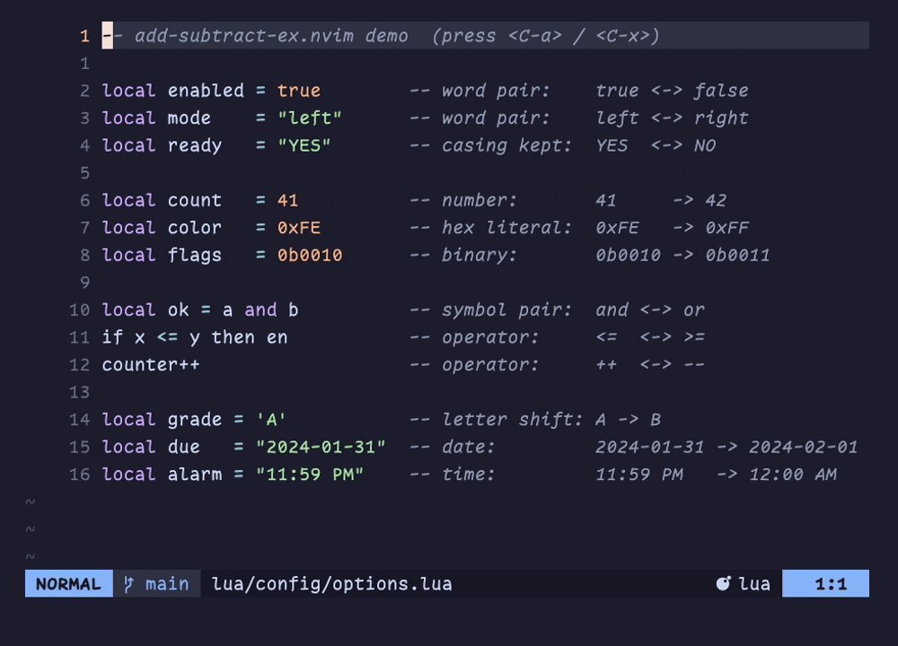

# add-subtract-ex.nvim

[](https://github.com/DRoma82/add-subtract-ex.nvim/actions/workflows/ci.yml)

An extended `CTRL-A` / `CTRL-X` for Neovim.



Native `CTRL-A` (`:help CTRL-A`) adds to the number at or after the cursor.
This plugin keeps that behavior (see the signed-number note below) and extends
the *same* keys to also:

- **Toggle word pairs** — `true`/`false`, `yes`/`no`, `on`/`off`, ... with casing preserved (`TRUE` → `FALSE`, `True` → `False`).
- **Invert symbol pairs** — `&&`/`||`, `==`/`!=`, `<=`/`>=`, `++`/`--`, `+`/`-`.
- Cycle word and symbol lists forward or backward, wrapping at either end. Weekdays and full month names work by default (`Sun` → `Mon`, `December` → `January`), with casing preserved.
- **Toggle Markdown checkboxes** — `- [ ]` ↔ `- [x]` (also `[X]`, `*`/`+` bullets, and `1.` lists) in `markdown` buffers, when the cursor is on or before the checkbox.
- **Shift letters** — `a` → `b`, `Z` stays `Z` (no wrapping), with a `count` (`3<C-a>`).
- **Step dates** — `yyyy-MM-dd` and `dd/MM/yyyy` (or `MM/dd/yyyy`, also with `yy`): the day, month, or year under the cursor moves, rolling over months and years (`2024-01-31` → `2024-02-01`).
- **Step times** — `HH:mm`, `HH:mm:ss`, and 12h `h:mm PM`: the part under the cursor moves and carries like a clock (`23:59` → `00:00`, `11:59 PM` → `12:00 AM`); `AM`/`PM` toggles.
- **Change visual selections** with `<C-a>`/`<C-x>` on every touched target. Use `g<C-a>`/`g<C-x>` for increasing steps per target, or fill blank lines to build sequences.
- **Repeat with `.`** in normal mode on the target under the cursor, numbers included, with the same count.
- **Defer to native numbers** — decimal, hex (`0xFF`), and binary (`0b1010`) literals are handled by native `CTRL-A`/`CTRL-X`.

In normal mode, the **earliest target at or after the cursor wins**, mirroring
how native `CTRL-A` targets the nearest number instead of always preferring one kind.

> ⚠️ **Signed numbers:** because `+`/`-` is a built-in symbol pair, by default a
> leading sign is toggled instead of incrementing the number. This applies to
> signed decimal, hex, and binary literals: `-5` → `+5`, `-0xFF` → `+0xFF`,
> `-0b1010` → `+0b1010` (native would give `-4`, `-0x100`, `-0b1011`). Set
> `sign_aware = true` to treat a `+`/`-` immediately before a digit as a number
> sign and defer to native (`-5` → `-4`, `-0xFF` → `-0x100`), while a standalone
> `+`/`-` still toggles.

## Install

### lazy.nvim

```lua
{
  "DRoma82/add-subtract-ex.nvim",
  -- opts = {} triggers setup() with defaults (maps <C-a>/<C-x>)
  opts = {},
}
```

### vim.pack (Neovim 0.12+)

Neovim's built-in manager doesn't run `setup()` for you, so call it after adding
the plugin:

```lua
vim.pack.add({
  { src = "https://github.com/DRoma82/add-subtract-ex.nvim" },
})

require("add-subtract-ex").setup() -- maps <C-a>/<C-x>
```

### packer.nvim

```lua
use({
  "DRoma82/add-subtract-ex.nvim",
  config = function()
    require("add-subtract-ex").setup()
  end,
})
```

## Configuration

Defaults:

```lua
require("add-subtract-ex").setup({
  -- Keys to map in normal and visual modes.
  --   nil (omit)  -> map <C-a> / <C-x>, plus visual g<C-a> / g<C-x>
  --   false       -> map nothing, leave native keys unchanged
  --   table       -> map these and their visual g-prefixed variants
  --                  omitted directions stay native
  keys = { increment = "<C-a>", decrement = "<C-x>" },

  -- Enable alphabetical letter shifting (a -> b).
  letters = true,

  -- Treat a +/- directly before a digit as a number sign: defer to native
  -- so signed numbers increment (-5 -> -4) instead of flipping (-5 -> +5).
  sign_aware = false,

  -- Date stepping. Set to false to disable.
  dates = {
    format = "dmy",        -- slash dates: "dmy" (dd/MM/yyyy) or "mdy" (MM/dd/yyyy)
    pad = false,           -- always write day/month with 2 digits
    default_part = "day",  -- part to step when the cursor is before the date
    century_pivot = 69,    -- yy below this is 20yy, otherwise 19yy (POSIX)
  },

  -- Time stepping. Set to false to disable.
  times = {
    default_part = "hour", -- part to step when the cursor is before the time
    two_part = "hm",       -- read a two-part time as "hm" (HH:mm) or "ms" (mm:ss)
  },

  -- Include all shipped word/symbol pairs and calendar cycles.
  builtins = true,
  months = "full",   -- "full" | "short" | "none"
  weekdays = "both", -- "full" | "short" | "both" | "none"

  -- Extra ordered lists. Two items toggle once; longer lists honor counts.
  -- Sharing any item replaces the whole earlier pair or cycle.
  words = {},
  symbols = {},
})
```

### Word and symbol cycles

`<C-a>` moves forward through a list; `<C-x>` moves backward. Both wrap at the
ends. Lists of three or more items honor counts, so `2<C-a>` on `Mon` becomes
`Wed`. Two-item lists remain single toggles and ignore counts in both directions.
Word matching is case-insensitive and preserves lowercase, uppercase, or title
case. Words match whole alphabetic tokens, not parts of identifiers.

- `months = "full"` ships `January` through `December`. Use `"short"` for `Jan`
  through `Dec`, or `"none"` to disable built-in month cycling. Only one form is
  enabled at a time because both contain `May`: full gives `May` → `June`, short
  gives `May` → `Jun`.
- `weekdays = "both"` ships `Monday` through `Sunday` and `Mon` through `Sun`.
  Use `"full"` or `"short"` for one form, or `"none"` to disable both.
- `builtins = false` disables all shipped pairs and cycles regardless of these
  settings. Custom `words` and `symbols` lists still work. Disabling a calendar
  cycle does not disable letter shifting; use `letters = false` for that.

### Dates

Dates are recognised as `yyyy-M-d` (ISO) and, for slash dates, `d/M/yyyy` or
`d/M/yy` (`M/d/...` with `format = "mdy"`). Day and month may be 1 or 2 digits;
the written padding is kept unless `pad = true`.

- The part under the cursor steps. A separator belongs to the part before it;
  a cursor before the date steps `default_part`.
- Days roll over months and years (`31/12/2024` → `01/01/2025`). Stepping the
  month or year clamps the day to the month's end (`2024-01-31` → `2024-02-29`).
- `yyyy` stops at `0000`/`9999`; `yy` stops at the edges of its pivot window
  (1969–2068 by default).
- Date-shaped text that isn't a real date (`31/02/2024`) is left alone with a
  warning.

> ⚠️ With dates on (the default), slash-separated number triples like `10/20/30`
> are read as dates, so `<C-a>` warns instead of incrementing a number. Set
> `dates = false` to get the old behavior back.

### Times

Times are recognised as `HH:mm` and `HH:mm:ss`, plus 12h `h:mm[:ss] AM` (the
space is optional, `am`/`pm` casing is kept). A 24h hour needs 2 digits, so
ratios and verse references like `3:16` stay numbers.

- The part under the cursor steps; a separator (including the space before
  `AM`/`PM`) belongs to the part before it, and a cursor before the time steps
  `default_part`. On `AM`/`PM` the key toggles it.
- Parts carry and wrap like a clock: `10:59` → `11:00`, `23:59` → `00:00`,
  `11:59 PM` → `12:00 AM`. A time after a date never changes the date.
- A two-part time is ambiguous (`05:30` could be HH:mm or mm:ss). It reads as
  HH:mm unless `two_part = "ms"`, where minutes wrap within `00`–`59`. Times
  with seconds or `AM`/`PM` are always clock times.
- Invalid times (`25:00`, `13:00 PM`) are left alone with a warning.

### Visual mode

Characterwise `v`, linewise `V`, and blockwise `<C-v>` selections change every
selected target, including multiple targets on the same line. Unlike native
visual number handling, the plugin changes the whole token when any part of
it is selected, even if it extends outside the selection.

- `<C-a>`/`<C-x>` adds or subtracts the count on each target.
- `g<C-a>`/`g<C-x>` uses the count multiplied by 1, 2, 3, and so on, in
  top-to-bottom, left-to-right order. Selecting `10 10` on two lines and pressing
  `g<C-a>` produces `11 12` and `13 14`.
- Fully selected dates and times step their configured `default_part`. If the
  selection starts inside a timestamp, that part steps instead.
- Word and symbol lists of three or more items use the count and progressive
  step, wrapping within their list.
- Two-item word and symbol pairs, checkboxes, and AM/PM remain single toggles.
  They occupy a position in the progressive sequence but ignore its step. Invalid
  dates and times warn, stay unchanged, and do not advance the sequence.
- With letters enabled, each ASCII letter outside a recognised token is a
  target, including letters in comments and prose. Set `letters = false` to
  leave those letters alone.
- By default, a number's sign is a separate symbol target. Selecting `-5`
  changes it to `+6`; with `sign_aware = true`, it becomes `-4`.

Blank or whitespace-only lines copy the preceding result and step it again.
For example, selecting `2000-10-30` and two blank lines linewise, then pressing
`<C-a>`, produces `2000-10-31`, `2000-11-01`, and `2000-11-02`. If the selection
starts on a blank line, its seed is the line immediately above the selection.
The `g` variants compound their increasing steps, so `10` and two blanks become
`11`, `13`, and `16`.

Linewise filling copies the whole line; characterwise and blockwise filling
copies the selected span. Use `virtualedit=block` to select a fixed rectangle
extending into blank or shorter lines. One `u` undoes the entire action,
including any filled lines. Visual dot-repeat is not supported.

### Custom keys (leaving `<C-a>`/`<C-x>` native)

```lua
require("add-subtract-ex").setup({
  keys = { increment = "<leader>a", decrement = "<leader>x" },
})
```

These keys work in both normal and visual modes. In visual mode,
`g<leader>a` and `g<leader>x` apply progressive steps. `keys = false` installs
no mappings in either mode. Configure this before the first `setup()` call;
calling `setup()` again does not remove mappings installed by an earlier call.

### Extending and overriding dictionaries

```lua
require("add-subtract-ex").setup({
  words = {
    { "foo", "bar", "baz" },
    { "true", "apple" },
  },
  symbols = {
    { "<", "=", ">" },
  },
})
```

Lists load in order, built-ins first. A later list sharing any item removes the
whole earlier list before installing the new one. Above, `true`/`false` is
replaced by `true`/`apple`, so `false` is no longer a toggle target. Overriding a
weekday or month likewise removes its entire cycle, leaving no stale mappings.
Items must be distinct nonempty strings, with at least two per list. Word items
must also be distinct after lowercasing. Invalid lists or calendar options raise
an error during `setup()`.

### Disabling built-ins

```lua
require("add-subtract-ex").setup({
  builtins = false,
  words = { { "true", "false" } },
})
```

## API

Without keymaps you can call the functions directly:

```lua
local ase = require("add-subtract-ex")
ase.increment() -- like <C-a>
ase.decrement() -- like <C-x>

-- Call these while a visual selection is active.
ase.increment_visual()     -- like visual <C-a>
ase.decrement_visual()     -- like visual <C-x>
ase.increment_visual(true) -- like visual g<C-a>
ase.decrement_visual(true) -- like visual g<C-x>
```

A count applies to numbers, letter shifts, dates, times, and word/symbol lists
of three or more items. `5<C-a>` adds 5, shifts a letter 5 positions, moves a date
or time part by 5, or advances a cycle 5 positions with wrapping. Two-item word
and symbol pairs are single toggles and ignore the count.

Normal-mode dot-repeat (`.`) works through the keys that `setup()` maps;
direct calls to `increment()`/`decrement()` are not repeatable.

## Tests

A dependency-free headless Neovim suite lives in `tests/run.lua`:

```sh
make test
# or
nvim --headless --clean -u NONE -l tests/run.lua
```

It exits non-zero on failure, so it drops straight into CI.

## Acknowledgements

This started life as a standalone Lua script in my personal Neovim config.
[nvim-toggler](https://github.com/nguyenvukhang/nvim-toggler) by
[@nguyenvukhang](https://github.com/nguyenvukhang) is what inspired me to turn
that config into a proper plugin — thanks for the nudge! Go check it out if you
want a focused, configurable word-inversion plugin.

## Similar plugins

- [nvim-toggler](https://github.com/nguyenvukhang/nvim-toggler)
- [dial.nvim](https://github.com/monaqa/dial.nvim)
- [vim-speeddating](https://github.com/tpope/vim-speeddating)
- [switch.vim](https://github.com/AndrewRadev/switch.vim)

## Contributors

[](https://github.com/DRoma82/add-subtract-ex.nvim/graphs/contributors)

## License

MIT
